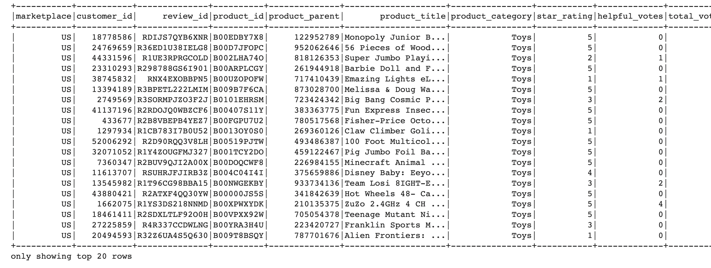
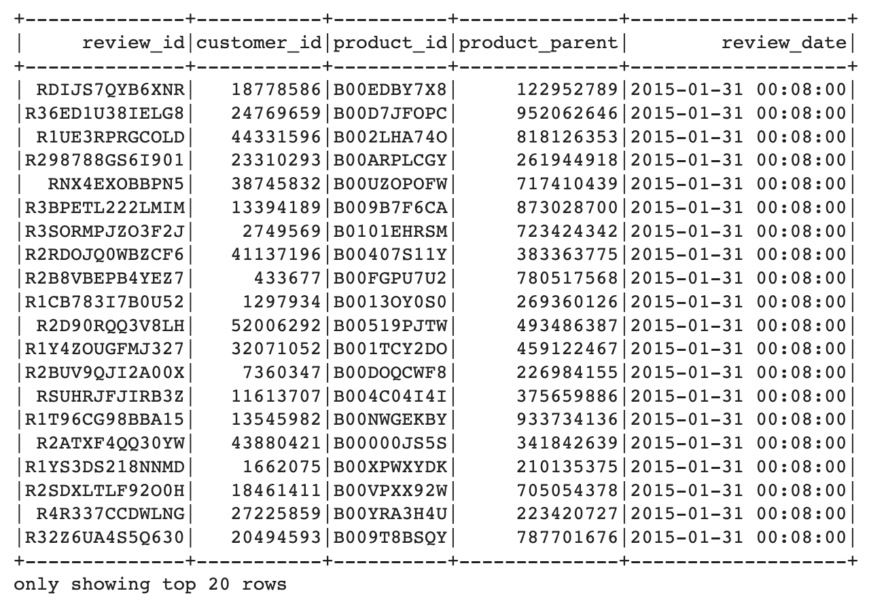
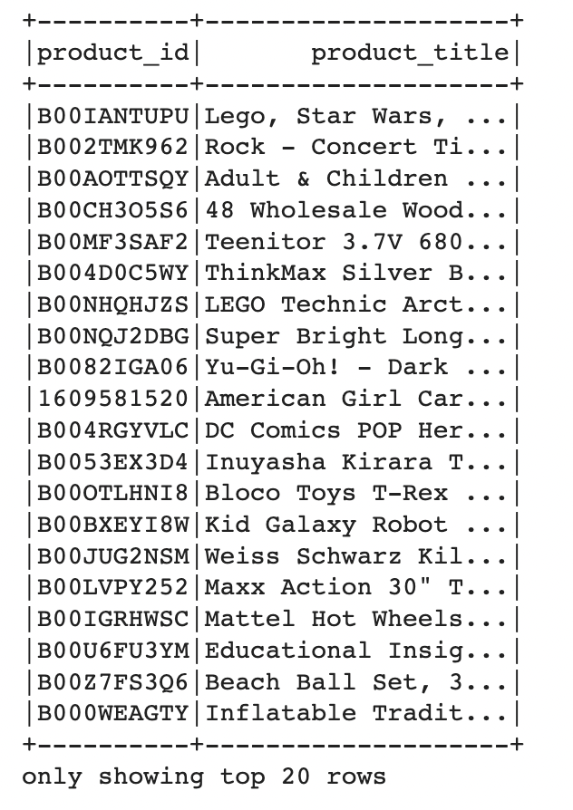
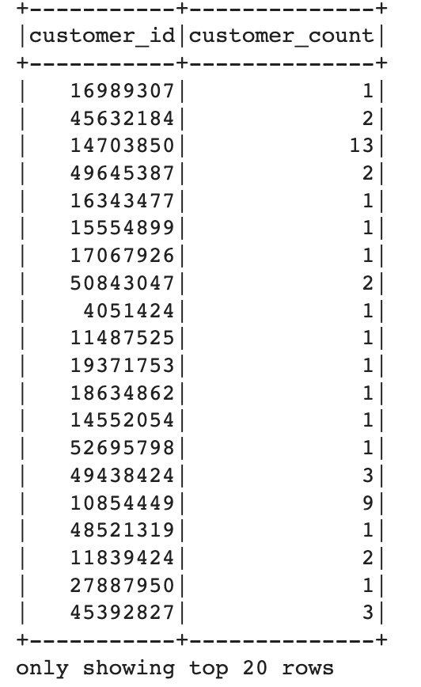
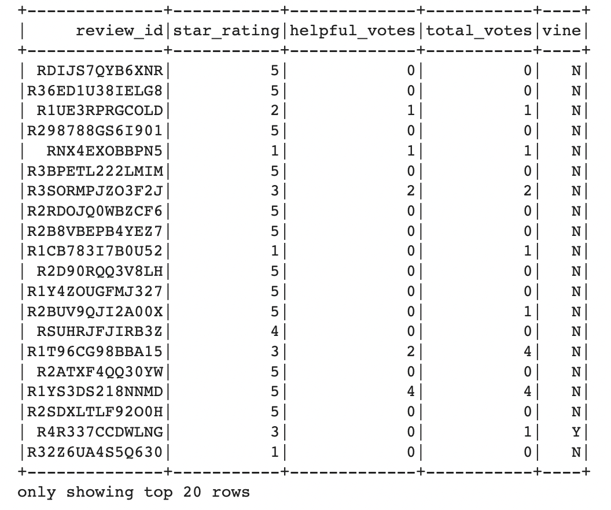

# Big-Data-ETL

## Amazon review ETL

Extract, Transform and Load Amazon Review Data Using Spark
## Objectives

### Step 1 - Extract the Data

* Explore the Amazon Reviews datasets and pick two datasets to perform ETL

* Read in each dataset using the correct header and sep parameters

* Get the number of rows in the dataset

### Step 2 - Transform the Data

* Create the "review_id_df" DataFrame with the appropriate columns and data types

* Create the "products_df" DataFrame that drops the duplicates in the "product_id" and "product_title columns

* Create the "customers_df" DataFrame that groups the data on the "customer_id" by the number of times a customer reviewed a product

* Create the "vine_df" DataFrame that has the "review_id", "star_rating", "helpful_votes", "total_votes", and "vine" columns

### Step 3 - Load the Data

* Export each DataFrame into the RDS instance to create four tables for each dataset

---------------------------------------------------

<b>Contact:</b> bronwynmilne64@gmail.com

